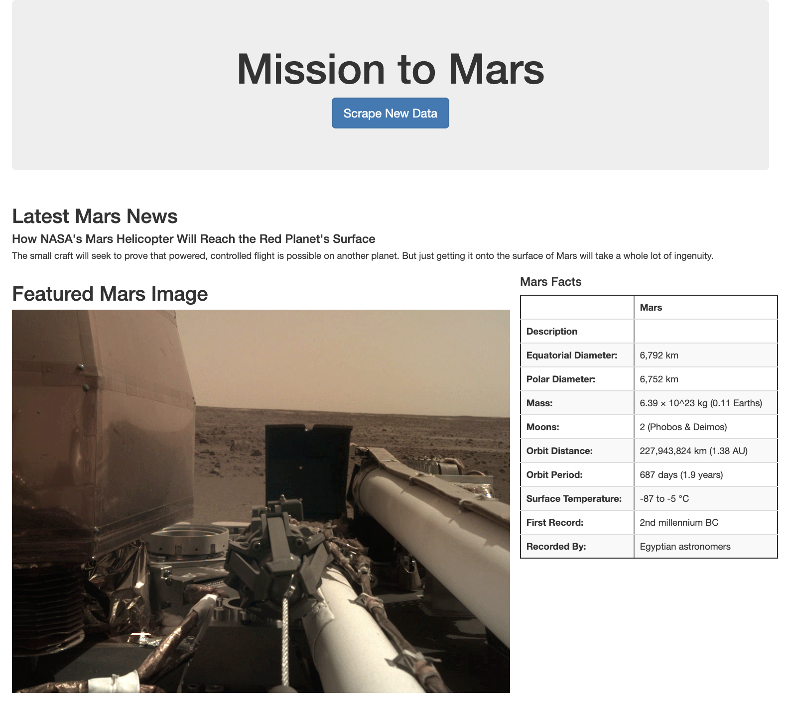

## Mission to Mars - Web Scraping with HTML/CSS

### Project Scope:

This project is for whom love astronomy and wishes to work collecting data on this subject one day; the team has decided to use a specific method of gathering the latest data: web scraping. Using this technique, she can pull data from multiple websites, store it in a database, then present the collected data in a central location: a webpage.
As a deliverable, the web app is looking good and functioning well, and the team was polishing it. The images of Mars’s hemispheres online reached a good resolution, and the site is scraping-friendly. Therefore, some adjustments to the current web app were necessary to include all four of the hemisphere images added to the scope afterwards. To do this, it used BeautifulSoup and Splinter to scrape full-resolution images of Mars’s hemispheres and the titles of those images, store the scraped data on a Mongo database, use a web application to display the data and alter the design of the web app to accommodate these images.

### Projet Deliverables:

Following up on the project scope, as described in the previous section, it was assigned to the team three main deliverables consisting of three technical analyses:
- Deliverable 1: Scrape Full-Resolution Mars Hemisphere Images and Titles.

- Deliverable 2: Update the Web App with Mars Hemisphere Images and Titles.

- Deliverable 3: Add Bootstrap 3 Components.

### Conclusion

In conclusion, this project uses web scraping targets to build fast databases and extract insights from these industry-specific ones. Like all data analysis, these insights must solve business problems. Furthermore, it guides how to automate a web page to retrieve the desired data. The information collected in this project testifies its trustworthy data collection and performs clever data manipulation for analysis afterwards.